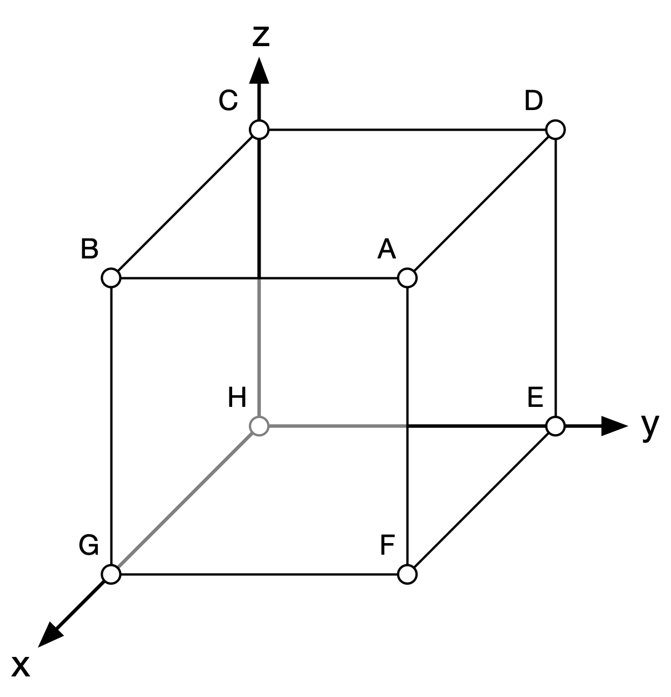
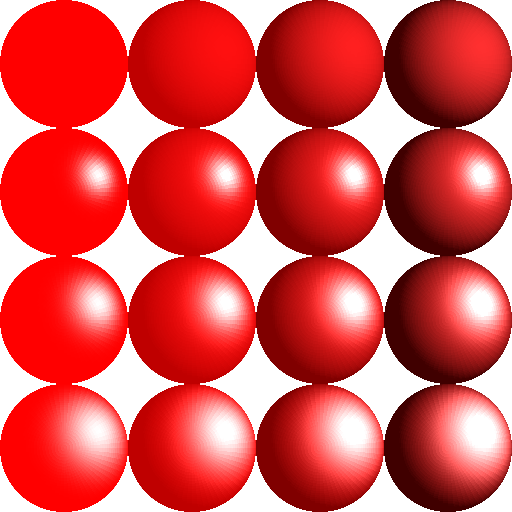

# Experimental 3d axis for matplotlib

This experimental project is an attempt at providing a better and more
versatile 3d axis for [Matplotlib](https://matplotlib.org). The heart of the
code is explained in this blog post: [Custom 3D engine in
Matplotlib](https://matplotlib.org/matplotblog/posts/custom-3d-engine/).

> 
> 
> Note that we cannot have a full 3d engine because we do not have a proper
> [zbuffer](https://en.wikipedia.org/wiki/Z-buffering) that allows to test
> individual pixels. This means we need to sort our points/lines/triangles in
> order to draw them from back to front. Most of the time, this does the trick
> but there exist some situations where it is impossible to avoid
> problems. For example, consider two triangles that intersect each other. In
> in such a case, we have to decide arbitrarily which triangle will be drawn on
> top of the other.

## Getting started

Let's start by drawing a simple hollow cube . The first step is to create a
regular 2D axes with specific limits:

```Python
import numpy as np
import matplotlib.pyplot as plt

fig = plt.figure(figsize=(6,6))
ax = fig.add_axes([0,0,1,1], xlim=[-1,1], ylim=[-1,1], aspect=1)
ax.axis("off")
```

This provides us with a normalized rendering viewport and all the 2D
coordinates we'll generate must fit inside this [-1,+1]×[-1,+1] area. Note that
the aspect has been set to 1 and must be kept to 1. If you change it, you might
observe some rendering deformations. Now it is time to define our cube. A cube
is described by 8 vertices and six faces. Let's write them:



```Python
vertices =  [ [+1,+1,+1],  # A
              [-1,+1,+1],  # B
              [-1,-1,+1],  # C
              [+1,-1,+1],  # D
              [+1,-1,-1],  # E
              [+1,+1,-1],  # F
              [-1,+1,-1],  # G
              [-1,-1,-1] ] # H
faces = [ [0, 1, 2, 3],   # ABCD: top face
          [0, 3, 4, 5],   # ADEF: right face
          [0, 5, 6, 1],   # AFGB: front face
          [1, 6, 7, 2],   # BGHC: left face
          [7, 4, 3, 2],   # HEDC: back face
          [4, 7, 6, 5] ]  # EFGH: bottom face

```


In order to render this cube, we have to transform our 3d coordinates into 2D
coordinates and for this, we need a camera. There are two types of camera
available: one for orthographics projection (`"ortho"`) and the other for
perspective projection (`"perpsective"`) as illustrated on the right.

```Python
from mpl3d import glm
from mpl3d.camera import Camera

camera = Camera("perspective", 45, 35, scale=0.5)
vertices = glm.transform(vertices, camera.transform)
```

If you look at the newly generated vertices, you'll notice that they're still
3D shaped (shape is (8,3)). But the (big) difference is the z coordinate that
now indicates the depth of each vertex that can be used to compute the depth
of each cube face such as to sort in order to render them from back to front:

```Python
faces = np.array([vertice[face] for face in faces])
index = np.argsort(-np.mean(faces[...,2].squeeze(), axis=-1))
vertices = faces[index][...,:2]
```


`vertices` is now a sorted array of 2d coordinates descring each face. Let's
render them using the versatile [PolyCollection](https://matplotlib.org/api/collections_api.html#matplotlib.collections.PolyCollection):

```Python
from matplotlib.collections import PolyCollection

collection = PolyCollection(vertices,
                            facecolor=(1,1,1,.75),
                            edgecolor="black")
ax.add_collection(collection)
plt.show()
```

You can notice that we are able to see through the cube (grey back lines)
thanks to the transparent color of each faces. This works only because we have
sorted the faces.

<br clear="both"/>

## Advanced usage

### Meshes


The [Mesh](../mpl3d/mesh.py) object allows to render a mesh that is described by a
set of vertices and a set of faces made of triangles. It is the responsability
of the user to provide the vertices and the faces. They can be generated
manually as for example in our cube example but it is generally easier to load
them from a file. The simplified [Stanford
bunny](https://en.wikipedia.org/wiki/Stanford_bunny) displayed on the right has
been loaded from a wavefront object file that has the advantage of being very
simple to parse (see [bunny.py](../bunny.py)). Note that the mesh object has an
update method such that it can be made interactive when the camera is
connected:
```Python
camera = Camera("ortho", scale=2)
vertices, faces = load("data/bunny.obj")
mesh = Mesh(ax, camera.transform, vertices, faces)
camera.connect(ax, mesh.update)
```


<br clear="both"/>

### Multiviews


A 3d axes lives inside a regular matplotlib axes such that it is
possible to have several 3d axes on the same figure. On the
[bunnies.py](bunnies.py) example on the right, there are four 3d axes. Three
are using an orthographic camera and the upper left is using a perspective
camera that is connected to the mouse, meaning you can rotate and zoom the
rendering by moving and scrolling the mouse when it is over the underlying
axes:
```Python
ax = subplot(221, xlim=[-1,+1], ylim=[-1,+1], aspect=1)
ax.axis("off")
camera = Camera("perspective",  -20, 0, 1.5)
camera.connect(ax, mesh.update)

ax = subplot(222, xlim=[-1,+1], ylim=[-1,+1], aspect=1)
camera = glm.ortho(-1,+1,-1,+1, 1, 100) @ glm.scale(2)
camera = camera @ glm.xrotate(90)
```

<br clear="both"/>

### Scatter plots


The [scatter.py](scatter.py) shows how to display a protein using a scatter
plot. Because we cannot z-test individual pixels, we have to find some
alternative display to suggest depth. This is done using two different
tricks. The first trick is to fade out points that are further from the
camera. This can be done very simply using the projected z coordinate that
corresponds to depth. The second trick is to double each point and to make all
the new point biggers, to place them behind he actual point and to pain them
using a transparent grey color. Since all the points are sorted back to fronts,
this will result in those grey points to shadow furhter points. If you enlarge
the image on the left, you can clearly see the effect. However, if you look
from a distance, this does the trick.

<br clear="both"/>

### Heightfield


<br clear="both"/>

### Lighting




